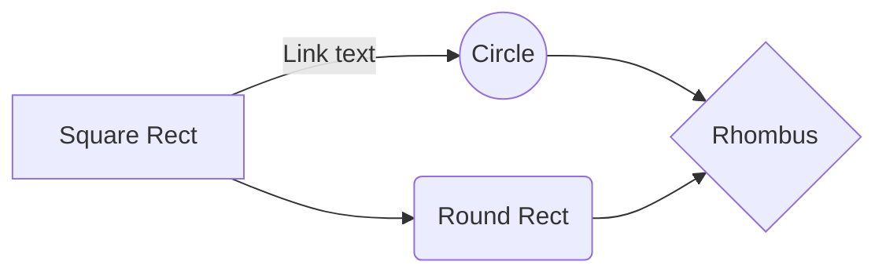

# hello-world - 1st level heading

## this is a heading - 2nd level
tekst do drugiego rozdziału

### heading - 3rd level

1. one
2. two
3. three

- text
- typing
- just one more

**bold** text
*italic* text
------------------------------------
for more information please visit [podmedics](http://podemdics.heroku.com "the new site")
------------------------------------
And this will produce a flow chart:

------------------------------------
Hi Ppl!

To jest pierwsza linijka tekstu o mnie.

To jest druga linijka tekstu o mnie!

Trzecia.
